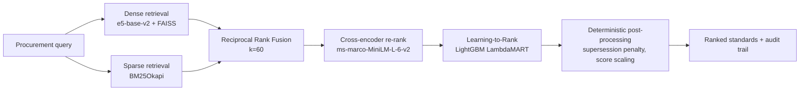

# AI-Powered Indian Standards (IS) Recommendation Engine

A semantic search and recommendation system that helps procurement officials
find the right Indian Standards (IS) for a product, specification, or tender
document — by meaning, not keyword matching.

Built for the Smart India Hackathon problem statement from the **Ministry of
Consumer Affairs, Department of Consumer Affairs**.

---

## ⚠️ Data coverage and limitations — read this first

We would rather state our scope plainly than imply coverage we do not have.

| | Status |
|---|---|
| **Standards in the corpus** | **45** ([`data/standards_corpus.json`](data/standards_corpus.json)) |
| **Real BIS coverage** | BIS publishes **~22,000** Indian Standards |
| **Data provenance** | IS numbers and titles are realistic but **not verified against the BIS catalogue**; every record carries `"verified": false`. Two entries (IS 8112:2018, IS 12269:2019) name editions that never existed — both standards were withdrawn into IS 269:2015 in 2016 — and the API flags them rather than serving them silently |
| **Sectors represented** | Electrical cables, cement & building materials, steel pipes & fittings, structural steel, plastic pipes, electrical installations, PPE |
| **Certification data** | **17 of 45 standards verified** against the BIS Scheme I list and QCO notifications, with the governing order recorded. The remaining 28 report `not_verified`, which is explicitly not a clearance |
| **Related-standards graph** | Fixture data, marked `verified: false` |

**What this means in practice:** queries inside the covered sectors return
sensible results. Queries outside them (textiles, machinery, chemicals, food,
and the overwhelming majority of the catalogue) have no correct answer
available.

The engine detects this and says so. `/retrieve` returns a `confidence` field
of `strong`, `uncertain` or `none`, judged on the cross-encoder relevance
score of the top hit — which, unlike the per-response `final_score`, is
comparable across queries. On a `none` verdict the UI drops the
"Recommended standards" heading entirely and presents the results as
"Nearest text matches … not recommendations". Searching for a safety helmet
does not produce a confident cable recommendation.

**About the accuracy numbers.** [`standards-retrieval/MODEL_AND_EVALUATION.md`](standards-retrieval/MODEL_AND_EVALUATION.md)
reports Top-1 accuracy of 95.8% and NDCG@5 of 0.9846. Those figures are real
and reproducible, but they are measured on a **30-standard** corpus against 24
queries written alongside it. At that scale retrieval is an easy problem.
**They demonstrate that the ranking pipeline is correctly built and that each
stage improves on the previous one — they are not a claim about real-world
accuracy over the full BIS catalogue.**

Rebuilding the indexes over the consolidated 45-standard corpus, NDCG@5 on
the same 24 queries:

| Pipeline | 30 standards | 45, old model | 45, retrained |
|---|---|---|---|
| Hybrid (dense + BM25 RRF) | 0.9430 | 0.9382 | 0.9382 |
| + Cross-encoder | 0.9609 | 0.9609 | 0.9609 |
| + LTR | **0.9846** | 0.9692 | **0.9846** |

What these numbers support is that **each stage improves on the one before
it**, consistently across both corpora. What they do *not* yet show is a
corpus-size effect: the middle column served the ranker trained on the
smaller corpus, and retraining on the corpus actually being served recovers
the score. Both corpora are small enough that retrieval remains easy.

Decline should still be expected at realistic scale, because near-duplicate
standards become far more common — but that is a reasoned expectation, not
something measured here.

Expanding to a verified, curated pilot dataset is tracked in
[`PROGRESS.md`](PROGRESS.md).

---

## Architecture



A four-stage retrieval funnel: cheap recall-oriented retrieval first, then
progressively more expensive and more precise re-ranking over a narrowed
candidate pool, then deterministic business rules that no model is allowed to
override.

---

## Repository layout

| Path | Purpose |
|---|---|
| [`standards-retrieval/`](standards-retrieval/) | **The backend.** Retrieval, ranking, LTR training, evaluation, feedback loop. Single source of truth |
| [`data/`](data/) | Datasets and the consolidation script — see [`data/README.md`](data/README.md) |
| [`frontend/`](frontend/) | React + Vite UI. Search, catalogue and detail screens run against the backend; the rest are labelled as illustrative |
| [`services/knowledge-reasoning/`](services/knowledge-reasoning/) | Graph expansion & compliance validation (fixture-backed; see its `INTEGRATION.md`) |
| [`app/`](app/) | Postgres/Neo4j/Chroma ingestion layer — the upgrade path from flat files. Reuses `standards-retrieval/` rather than vendoring it |
| [`api/`](api/) | Earlier standalone API prototype |

A duplicate of the retrieval pipeline previously lived under
`app/services/standards_retrieval/`. It was removed in Phase B and archived on
the `archive/app-standards-retrieval-duplicate` branch.

---

## Setup

### Requirements

- **Python 3.11** — required. The ML stack (torch, faiss, lightgbm) does not
  have wheels for Python 3.14, which is the default `python` on some machines.
- **Node.js 20+**

### Backend

```bash
py -3.11 -m venv .venv
.venv/Scripts/python -m pip install --upgrade pip

# CPU-only torch (~200 MB instead of the ~2.5 GB CUDA build)
.venv/Scripts/python -m pip install torch --index-url https://download.pytorch.org/whl/cpu
.venv/Scripts/python -m pip install -r standards-retrieval/requirements.txt
```

Run the API:

```bash
cd standards-retrieval
../.venv/Scripts/python -m uvicorn main:app --reload --port 8000
```

First start downloads the embedding and cross-encoder models from Hugging Face
(a few hundred MB) and takes ~15–20 seconds. Subsequent starts use the local
cache.

- API docs: http://localhost:8000/docs
- Health: http://localhost:8000/health

#### Choosing a corpus

The engine serves the 30-standard `mock_corpus.json` by default, because the
committed indexes and trained ranker were built against it. To serve the
consolidated 45-standard corpus instead:

```bash
STANDARDS_CORPUS=canonical python -m uvicorn main:app --port 8000
```

`/health` reports which is loaded. Indexes and models are stored per corpus,
so switching never overwrites the other one's artifacts. See
[`data/README.md`](data/README.md) for how to rebuild them.

### Frontend

```bash
cd frontend
npm install
npm run dev
```

Open http://localhost:5173. The search screen (`/app/query`) calls the live
backend, so **start the backend first** — the UI says so plainly if it cannot
reach it, and never substitutes canned results for live ones.

To point at a backend on a different host or port, copy `.env.example` to
`.env` and set `VITE_API_URL`.

#### What is connected, and what is not

| Screen | State |
|---|---|
| `/app/query` — search and results | **Live.** `POST /retrieve` |
| `/app/catalogue` — standards catalogue | **Live.** `GET /standards` |
| `/app/standard/:code` — standard detail | **Live.** `GET /standards/{id}` |
| Landing page | Static copy; the hero panel is an illustration |
| The other 12 screens | Fixture data, each labelled "Illustrative screen — not live data" in the UI |

The twelve fixture screens show an intended workflow rather than computed
results, and say so on the page. Wiring them needs backend work that does not
exist yet — certification requires the official compulsory-certification
lists, the standards map requires relationship data, the dashboard requires
persisted query history. Progress is tracked in [`PROGRESS.md`](PROGRESS.md).

### Tests

```bash
cd standards-retrieval
PYTHONPATH=. ../.venv/Scripts/python -m pytest tests -q
```

---

## Windows note: line endings and model files

This repository contains a LightGBM model (`models/ltr_model.txt`) whose
header encodes **byte offsets** into the file. With Git's `core.autocrlf=true`
(the Windows default), checkout rewrites LF to CRLF, every offset shifts, and
the model fails to load with `Model format error, expect a tree here`.

[`.gitattributes`](.gitattributes) marks these artifacts as binary to prevent
this. If you cloned before it existed and see that error, re-checkout the file:

```bash
git rm --cached standards-retrieval/models/ltr_model.txt
git checkout -- standards-retrieval/models/ltr_model.txt
```

---

## Status

This is an in-progress hackathon build. See [`PROGRESS.md`](PROGRESS.md) for
what works, what is stubbed, and what is next.

## License

MIT
