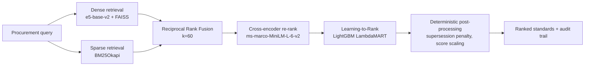

# AI-Powered Indian Standards (IS) Recommendation Engine

A semantic search and recommendation system that helps procurement officials
find the right Indian Standards (IS) for a product, specification, or tender
document — by meaning, not keyword matching.

Built for the Smart India Hackathon problem statement from the **Ministry of
Consumer Affairs, Department of Consumer Affairs**.

---

## ⚠️ Data coverage and limitations — read this first

We would rather state our scope plainly than imply coverage we do not have.

| | Status |
|---|---|
| **Standards in the corpus** | **30** (development corpus) |
| **Real BIS coverage** | BIS publishes **~22,000** Indian Standards |
| **Data provenance** | IS numbers and titles are realistic but **not verified against the BIS catalogue** |
| **Sectors represented** | Electrical cables, cement/concrete, structural steel (partial) |
| **Certification data** | Placeholder rules, not sourced from the official compulsory-certification lists |
| **Related-standards graph** | Fixture data, marked `verified: false` |

**What this means in practice:** queries inside the covered sectors return
sensible results. Queries outside them (PPE, textiles, machinery, chemicals,
food, and most of the catalogue) have no correct answer available and the
system cannot return one.

**About the accuracy numbers.** [`standards-retrieval/MODEL_AND_EVALUATION.md`](standards-retrieval/MODEL_AND_EVALUATION.md)
reports Top-1 accuracy of 95.8% and NDCG@5 of 0.9846. Those figures are real
and reproducible, but they are measured on the 30-standard corpus above
against 24 queries written alongside it. At that scale retrieval is an easy
problem. **They demonstrate that the ranking pipeline is correctly built and
that each stage improves on the previous one — they are not a claim about
real-world accuracy over the full BIS catalogue.**

Expanding to a verified, curated pilot dataset is tracked in
[`PROGRESS.md`](PROGRESS.md).

---

## Architecture



A four-stage retrieval funnel: cheap recall-oriented retrieval first, then
progressively more expensive and more precise re-ranking over a narrowed
candidate pool, then deterministic business rules that no model is allowed to
override.

---

## Repository layout

| Path | Purpose |
|---|---|
| [`standards-retrieval/`](standards-retrieval/) | **Primary backend.** Retrieval, ranking, LTR training, evaluation, feedback loop |
| [`frontend/`](frontend/) | React + Vite UI (19 screens) |
| [`services/knowledge-reasoning/`](services/knowledge-reasoning/) | Graph expansion & compliance validation (fixture-backed; see its `INTEGRATION.md`) |
| [`app/`](app/) | Postgres/Neo4j/Chroma ingestion layer — **contains a stale duplicate of `standards-retrieval/`** (see PROGRESS.md) |
| [`api/`](api/) | Earlier standalone API prototype |
| [`data/`](data/) | Dataset files and derived indexes |

---

## Setup

### Requirements

- **Python 3.11** — required. The ML stack (torch, faiss, lightgbm) does not
  have wheels for Python 3.14, which is the default `python` on some machines.
- **Node.js 20+**

### Backend

```bash
py -3.11 -m venv .venv
.venv/Scripts/python -m pip install --upgrade pip

# CPU-only torch (~200 MB instead of the ~2.5 GB CUDA build)
.venv/Scripts/python -m pip install torch --index-url https://download.pytorch.org/whl/cpu
.venv/Scripts/python -m pip install -r standards-retrieval/requirements.txt
```

Run the API:

```bash
cd standards-retrieval
../.venv/Scripts/python -m uvicorn main:app --reload --port 8000
```

First start downloads the embedding and cross-encoder models from Hugging Face
(a few hundred MB) and takes ~15–20 seconds. Subsequent starts use the local
cache.

- API docs: http://localhost:8000/docs
- Health: http://localhost:8000/health

### Frontend

```bash
cd frontend
npm install
npm run dev
```

### Tests

```bash
cd standards-retrieval
PYTHONPATH=. ../.venv/Scripts/python -m pytest tests -q
```

---

## Windows note: line endings and model files

This repository contains a LightGBM model (`models/ltr_model.txt`) whose
header encodes **byte offsets** into the file. With Git's `core.autocrlf=true`
(the Windows default), checkout rewrites LF to CRLF, every offset shifts, and
the model fails to load with `Model format error, expect a tree here`.

[`.gitattributes`](.gitattributes) marks these artifacts as binary to prevent
this. If you cloned before it existed and see that error, re-checkout the file:

```bash
git rm --cached standards-retrieval/models/ltr_model.txt
git checkout -- standards-retrieval/models/ltr_model.txt
```

---

## Status

This is an in-progress hackathon build. See [`PROGRESS.md`](PROGRESS.md) for
what works, what is stubbed, and what is next.

## License

MIT
