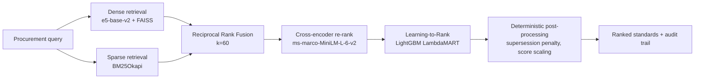

# AI-Powered Indian Standards (IS) Recommendation Engine

A semantic search and recommendation system that helps procurement officials
find the right Indian Standards (IS) for a product, specification, or tender
document — by meaning, not keyword matching.

Built for the Smart India Hackathon problem statement from the **Ministry of
Consumer Affairs, Department of Consumer Affairs**.

---

## ⚠️ Data coverage and limitations — read this first

We would rather state our scope plainly than imply coverage we do not have.

| | Status |
|---|---|
| **Standards in the corpus** | **4,282** across 17 sectors ([`data/standards_corpus_full.json`](data/standards_corpus_full.json)) |
| **Real BIS coverage** | BIS publishes **~22,000** Indian Standards, so this is roughly **19%** |
| **Where the text comes from** | **4,186** records carry the **published SCOPE clause** of the actual standard, read from the Public.Resource.Org archive on archive.org. The text is OCR of a scanned document, so it contains recognition errors. The remaining 96 are earlier pilot records whose scope text we wrote ourselves |
| **Verified against the BIS catalogue** | **None.** Every record carries `"verified": false`. The IS numbers and titles are real; nothing has been checked against BIS directly |
| **Certification data** | **17 standards researched** against the BIS Scheme I list and QCO notifications, with the governing order recorded — **0.4%** of the corpus. Everything else reports `not_verified`, which is explicitly **not** a clearance |
| **Amendments** | **3 standards researched** from BIS product manuals. The rest report `checked: false`, which is not a statement that they have none |
| **Related-standards graph** | **25 relationships across 16 standards**, read from the referred-standards annexes. Citations to standards outside the corpus are shown and flagged rather than hidden |

**The curated data did not scale with the corpus.** Certification, amendment
and relationship research was done when the corpus was 45 standards, and it
still covers only those. At 4,282 standards that is under half a percent. The
engine says so per-record rather than implying coverage it does not have, but
it is the single biggest gap between this and something a procurement officer
could rely on.

**What this means in practice:** queries inside the covered sectors return
sensible results. Queries outside them (textiles, machinery, chemicals, food,
and the overwhelming majority of the catalogue) have no correct answer
available.

## Plain-language explanations (optional)

With a local [Ollama](https://ollama.com) server running and
`qwen2.5:7b-instruct` pulled, each result can carry a one-sentence reason it
matched. Tick "Explain why each standard matched" before searching.

```bash
ollama pull qwen2.5:7b-instruct
```

It is **off by default** and entirely optional: a query is ~380 ms without it
and ~2.5 s with it, and the results are identical either way — only prose is
added. Without Ollama the option is not offered and nothing else changes.

**The model never decides anything.** It only describes candidates retrieval
already chose; it does not rank, filter, or contribute to certification or
supersession verdicts. Every IS number it returns is checked against the
candidate list and discarded if it was not one of them, because a fabricated
standard number in a tender document is the worst output this system could
produce. Out-of-scope queries skip it entirely, so a no-match result never
acquires a fluent explanation of why the wrong standards almost fit.

---

## Languages

Queries can be written in **English, Hindi, Tamil, Bengali, Marathi or
Telugu**. Non-English queries are translated to English before searching
(facebook/nllb-200-distilled-600M, running locally — no API key), and the UI
shows both what you typed and what was actually searched, because a wrong
machine translation quietly returning wrong standards is the failure worth
guarding against.

This is not cosmetic. Untranslated, a Hindi query scores −8.4 on the
cross-encoder and is correctly rejected as no-match; translated, the same
query scores +3.9 and returns the standard the English phrasing returns.

The interface chrome is still English-only — only queries and results are
multilingual.

---

The engine detects this and says so. `/retrieve` returns a `confidence` field
of `strong`, `uncertain` or `none`, judged on the cross-encoder relevance
score of the top hit — which, unlike the per-response `final_score`, is
comparable across queries. On a `none` verdict the UI drops the
"Recommended standards" heading entirely and presents the results as
"Nearest text matches … not recommendations". Searching for a safety helmet
does not produce a confident cable recommendation.

**About the accuracy numbers.** [`standards-retrieval/MODEL_AND_EVALUATION.md`](standards-retrieval/MODEL_AND_EVALUATION.md)
reports Top-1 accuracy of 95.8% and NDCG@5 of 0.9846. Those figures are real
and reproducible, but they are measured on a **30-standard** corpus against 24
queries written alongside it. At that scale retrieval is an easy problem.
**They demonstrate that the ranking pipeline is correctly built and that each
stage improves on the previous one — they are not a claim about real-world
accuracy over the full BIS catalogue.**

Rebuilding the indexes over the consolidated 45-standard corpus, NDCG@5 on
the same 24 queries:

| Pipeline | 30 standards | 45, old model | 45, retrained |
|---|---|---|---|
| Hybrid (dense + BM25 RRF) | 0.9430 | 0.9382 | 0.9382 |
| + Cross-encoder | 0.9609 | 0.9609 | 0.9609 |
| + LTR | **0.9846** | 0.9692 | **0.9846** |

What these numbers support is that **each stage improves on the one before
it**, consistently across both corpora. What they do *not* yet show is a
corpus-size effect: the middle column served the ranker trained on the
smaller corpus, and retraining on the corpus actually being served recovers
the score. Both corpora are small enough that retrieval remains easy.

Decline should still be expected at realistic scale, because near-duplicate
standards become far more common — but that is a reasoned expectation, not
something measured here.

Expanding to a verified, curated pilot dataset is tracked in
[`PROGRESS.md`](PROGRESS.md).

---

## Architecture



A four-stage retrieval funnel: cheap recall-oriented retrieval first, then
progressively more expensive and more precise re-ranking over a narrowed
candidate pool, then deterministic business rules that no model is allowed to
override.

---

## Repository layout

| Path | Purpose |
|---|---|
| [`standards-retrieval/`](standards-retrieval/) | **The backend.** Retrieval, ranking, LTR training, evaluation, feedback loop. Single source of truth |
| [`data/`](data/) | Datasets and the consolidation script — see [`data/README.md`](data/README.md) |
| [`frontend/`](frontend/) | React + Vite UI. Search, catalogue and detail screens run against the backend; the rest are labelled as illustrative |
| [`services/knowledge-reasoning/`](services/knowledge-reasoning/) | Graph expansion & compliance validation (fixture-backed; see its `INTEGRATION.md`) |
| [`app/`](app/) | Postgres/Neo4j/Chroma ingestion layer — the upgrade path from flat files. Reuses `standards-retrieval/` rather than vendoring it |
| [`api/`](api/) | Earlier standalone API prototype |

A duplicate of the retrieval pipeline previously lived under
`app/services/standards_retrieval/`. It was removed in Phase B and archived on
the `archive/app-standards-retrieval-duplicate` branch.

---

## Setup

### Requirements

- **Python 3.11** — required. The ML stack (torch, faiss, lightgbm) does not
  have wheels for Python 3.14, which is the default `python` on some machines.
- **Node.js 20+**

### Backend

```bash
py -3.11 -m venv .venv
.venv/Scripts/python -m pip install --upgrade pip

# CPU-only torch (~200 MB instead of the ~2.5 GB CUDA build)
.venv/Scripts/python -m pip install torch --index-url https://download.pytorch.org/whl/cpu
.venv/Scripts/python -m pip install -r standards-retrieval/requirements.txt
```

Run the API:

```bash
cd standards-retrieval
../.venv/Scripts/python -m uvicorn main:app --reload --port 8000
```

First start downloads the embedding and cross-encoder models from Hugging Face
(a few hundred MB) and takes ~15–20 seconds. Subsequent starts use the local
cache.

- API docs: http://localhost:8000/docs
- Health: http://localhost:8000/health

#### Choosing a corpus

The engine serves the 30-standard `mock_corpus.json` by default, because the
committed indexes and trained ranker were built against it. **For a demo, use
the full corpus** — it has the ingested published-text standards:

```bash
# from the repository root
STANDARDS_CORPUS=canonical .venv/Scripts/python -m uvicorn main:app --port 8000 --app-dir standards-retrieval

# or, from inside standards-retrieval/
STANDARDS_CORPUS=canonical python -m uvicorn main:app --port 8000
```

`/health` reports which is loaded. Indexes and models are stored per corpus,
so switching never overwrites the other one's artifacts. See
[`data/README.md`](data/README.md) for how to rebuild them.

### Frontend

```bash
cd frontend
npm install
npm run dev
```

Open http://localhost:5173. The search screen (`/app/query`) calls the live
backend, so **start the backend first** — the UI says so plainly if it cannot
reach it, and never substitutes canned results for live ones.

To point at a backend on a different host or port, copy `.env.example` to
`.env` and set `VITE_API_URL`.

#### What is connected, and what is not

| Screen | State |
|---|---|
| `/app/query` — search and results | **Live.** `POST /retrieve` |
| `/app/catalogue` — standards catalogue | **Live.** `GET /standards` |
| `/app/standard/:code` — standard detail | **Live.** `GET /standards/{id}` |
| Landing page | Static copy; the hero panel is an illustration |
| The other 12 screens | Fixture data, each labelled "Illustrative screen — not live data" in the UI |

The twelve fixture screens show an intended workflow rather than computed
results, and say so on the page. Wiring them needs backend work that does not
exist yet — certification requires the official compulsory-certification
lists, the standards map requires relationship data, the dashboard requires
persisted query history. Progress is tracked in [`PROGRESS.md`](PROGRESS.md).

### Tests

```bash
cd standards-retrieval
PYTHONPATH=. ../.venv/Scripts/python -m pytest tests -q
```

---

## Windows note: line endings and model files

This repository contains a LightGBM model (`models/ltr_model.txt`) whose
header encodes **byte offsets** into the file. With Git's `core.autocrlf=true`
(the Windows default), checkout rewrites LF to CRLF, every offset shifts, and
the model fails to load with `Model format error, expect a tree here`.

[`.gitattributes`](.gitattributes) marks these artifacts as binary to prevent
this. If you cloned before it existed and see that error, re-checkout the file:

```bash
git rm --cached standards-retrieval/models/ltr_model.txt
git checkout -- standards-retrieval/models/ltr_model.txt
```

---

## What is built

| Capability | State |
|---|---|
| Semantic search (dense + BM25 + cross-encoder + learned ranker) | Live, ~200 ms |
| Refuses to answer outside its coverage | Live |
| Mandatory BIS certification flags with governing QCO | 17 standards researched, 0.4% of the corpus |
| Published amendments with paste-ready citation | 3 standards researched |
| Allied-standards cluster from referred-standards annexes | 25 relationships, 16 standards |
| Queries in 6 languages, translated locally | Live |
| Tender document upload (PDF/DOCX/TXT) | Live |
| Tender builder with live recommendations and clause generation | Live |
| Plain-language explanations from a local LLM | Optional, off by default |

Everything runs locally. There are no API keys and no cloud services.

## Testing

```bash
# Backend — 92 tests
PYTHONPATH=standards-retrieval .venv/Scripts/python -m pytest standards-retrieval/tests -q

# End-to-end — 22 tests, needs both servers running
cd frontend && npm run test:e2e
```

The end-to-end suite runs against a live backend rather than mocks, because
the failures worth catching are integration failures. Two of its tests exist
specifically to stop the honesty guarantees regressing: an out-of-scope query
must render zero recommendation cards, and screens showing sample data must
carry the "Illustrative screen" label while live ones must not.

**Fresh-clone verified.** The project was cloned to a clean directory and both
suites run from it without any additional setup beyond the install steps
above — including the LightGBM models, which survive checkout intact thanks to
[`.gitattributes`](.gitattributes).

## Demo

[`docs/demo-script.md`](docs/demo-script.md) is a timed seven-minute
walkthrough with the setup checklist, the questions judges tend to ask, and
what to do when something breaks. Every step in it has been run against the
live system.

## Status

See [`PROGRESS.md`](PROGRESS.md) for the full build log — what was found
broken, what was decided and why, and what remains open.

## License

MIT
