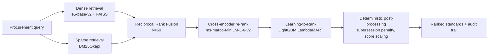

# AI-Powered Indian Standards (IS) Recommendation Engine

A semantic search and recommendation system that helps procurement officials
find the right Indian Standards (IS) for a product, specification or tender
document, by meaning rather than by keyword matching.

Built for the Smart India Hackathon problem statement from the **Ministry of
Consumer Affairs, Department of Consumer Affairs**.

---

## ⚠️ Data coverage and limitations: read this first

We would rather state our scope plainly than imply coverage we do not have.

| | Status |
|---|---|
| **Standards in the corpus** | **21,848 records** ([`data/standards_corpus_full.json`](data/standards_corpus_full.json)), covering **19,597 distinct standards**. Each published edition is its own record |
| **Current vs. superseded** | **19,604 current** and **2,244 superseded** editions. An older edition is marked superseded when the corpus holds a newer edition of the same standard |
| **Where it comes from** | The complete Public.Resource.Org archive of the BIS catalogue on archive.org: 21,937 readable standards out of 22,024 items. It includes 579 IS/ISO and IS/IEC adoptions and 69 SP publications, such as the National Building Code (SP 7) |
| **Where the text comes from** | **13,749** records carry the **published SCOPE clause** of the actual standard. It is OCR of a scanned document, so it contains recognition errors. **8,003** are kept on their real number and title only, because no usable scope clause could be read. No scope text is ever written to fill the gap |
| **Currency** | The archive is a snapshot. Standards BIS published after it are not in the corpus |
| **Verified against the BIS catalogue** | **None.** Every record carries `"verified": false`. The IS numbers and titles are real; nothing has been checked against BIS directly |
| **Certification data** | **17 standards researched** against the BIS Scheme I list and QCO notifications, with the governing order recorded. Everything else reports `not_verified`, which is explicitly **not** a clearance |
| **Amendments** | **3 standards researched** from BIS product manuals. The rest report `checked: false`, which is not a statement that they have none |
| **Related-standards graph** | **88,623 links from 16,944 standards**, read automatically from each standard's own REFERENCES clause and citations, plus 25 read and typed by hand. Every automatic link carries the passage it was read from. On samples it found every hand-read link the text supports and read about 97% of links correctly. Citations to standards outside the corpus are shown and flagged rather than hidden |

**Certification and amendment data did not scale with the corpus.** That
research was done by hand when the corpus was 45 standards, and it still
covers only those: under 0.1% of the corpus today. (The related-standards
graph did scale: it is now read from the standards' own text.) The engine says so on
every record rather than implying coverage it does not have. This is the
biggest gap between this engine and something a procurement officer could
rely on without checking.

**What this means in practice:** search now covers essentially the whole
published catalogue, so most product queries have a real answer to find, and
the standards a result depends on can be followed from it. What it cannot
tell you on its own is whether a product needs mandatory certification, which
amendments are in force, or whether BIS has revised a standard since the
archive snapshot.

## Usage figures

The dashboard at `/app` reports counted usage, not a mock-up. Every figure is
read from two append-only logs the engine writes itself:

| File | Written when | Feeds |
|---|---|---|
| `data/query_logs.jsonl` | every search `/retrieve` serves | volume, match rate, response time, sector spread |
| `data/interaction_logs.jsonl` | a standard is added to a spec or dismissed | acceptance rate, and the LTR retraining loop |

Three rules keep the screen honest, and each is covered by a test:

- **Synthetic records are never counted as usage.** 124 interaction records
  were generated to bootstrap the ranker. They are real records of a real
  pipeline run, but nobody used the system to produce them, so they are
  excluded from every live figure and reported separately.
- **A figure that cannot be computed is not shown.** An acceptance rate with
  no decisions behind it renders as a dash, never as 0%. Those are different
  statements.
- **An unreachable engine is not an empty one.** A backend that is down shows
  an error, not "no queries yet".

A fresh clone starts with no query log and the dashboard says so, which is the
correct answer for an engine nobody has searched.

### Auditing a tender, and reading a BOQ

Two screens take a document rather than a query:

- **Audit** (`/app/audit`) reads a tender, finds every IS number it cites, and
  checks each against the corpus: superseded editions (naming the
  replacement), amendments in force that the citation omits, citations with no
  edition year, and standards the corpus cannot verify at all.
- **Upload tender / BOQ** (`/app/boq`) splits a bill of quantities into its
  line items and runs a **separate search for each**. This matters more than
  it sounds: flattening a BOQ into one query lets the first item's vocabulary
  dominate the ranking, so the cement silently loses to the cable.

The audit's limit is the important part. It checks the citations a document
**already makes**, not whether the tender cites the right standards for the
goods it describes, which needs someone to read the specification. So a
document with no findings has not passed, and a document citing nothing at all
produces no findings while being the worst case. Both states say so.

### Standards hygiene and corpus health

Two more screens read from the engine rather than from fixtures:

- **Standards hygiene** (`/app/alerts`) lists superseded editions and
  standards with published amendments in force, computed from the corpus.
  Each superseded edition names the current edition that replaces it. With
  the full archive loaded that is about 2,240 findings.
- **Corpus health** (`/app/compliance`) counts how complete the corpus's own
  metadata is (certification confirmed vs. unverified, amendments
  researched), always as a ratio against the total, because 13 confirmed
  records mean nothing without the total they are out of.

Neither is a notification feed. **Nothing monitors BIS for newly published
revisions**, so no finding carries a timestamp: the corpus cannot say when a
revision was published, and a relative time on a fact read from a static file
would be an invention. A short amendment list is not an all-clear either,
because amendments are researched for only 3 standards, and the screen states
the unchecked remainder rather than implying a clean bill of health.

## Plain-language explanations (optional)

With a local [Ollama](https://ollama.com) server running and
`qwen2.5:7b-instruct` pulled, each recommended standard carries a short
**Why it matches** note: what the standard covers and how it relates to the
requirement (the product itself, a different grade, a different product).

```powershell
winget install --id Ollama.Ollama -e     # Windows; see ollama.com for macOS/Linux
ollama pull qwen2.5:7b-instruct          # about 4.7 GB
```

**Results never wait for it.** A search returns at retrieval speed and the
notes fill in afterwards from a separate `POST /explain` call, with a
placeholder on each card while they are written. Measured on an RTX 4060
laptop GPU: results in about 0.4 s, notes about 4 s later. The engine loads
the model in the background at startup and asks Ollama to keep it resident
for 30 minutes, because the first load takes over a minute.

The **Explain matches** chip in the search box appears only when `/health`
reports the model ready (`explanations_available`), and is on by default
once it does; the choice is remembered per browser. The engine rechecks
availability on a timer, so starting Ollama after the engine works without a
restart. Without Ollama the option is simply not offered.

**The model never decides anything.** It only describes candidates retrieval
already chose; it does not rank, filter, or contribute to certification or
supersession verdicts. Every IS number it returns is checked against the
candidate list and discarded if it was not one of them, because a fabricated
standard number in a tender document is the worst output this system could
produce. `/explain` only passes the model standards the corpus actually holds,
and reasons too short to say anything ("fits the requirement") are dropped
rather than shown. Out-of-scope queries skip it entirely, so a no-match result
never acquires a fluent explanation of why the wrong standards almost fit.

---

## Languages

Queries can be written in **English, Hindi, Tamil, Bengali, Marathi or
Telugu**. Non-English queries are translated to English before searching
(facebook/nllb-200-distilled-600M, running locally, no API key), and the UI
shows both what you typed and what was actually searched, because a wrong
machine translation quietly returning wrong standards is the failure worth
guarding against.

This is not cosmetic. Untranslated, a Hindi query scores −8.4 on the
cross-encoder and is correctly rejected as no-match; translated, the same
query scores +3.9 and returns the standard the English phrasing returns.

The interface itself is English-only; only queries and results are
multilingual.

---

## Accuracy, and saying when it does not know

`/retrieve` returns a `confidence` of `strong`, `uncertain` or `none`, judged
on the cross-encoder relevance score of the top hit, which, unlike the
per-response `final_score`, is comparable across queries. On a `none` verdict
the UI drops the "Recommended standards" heading entirely and presents the
results as "Nearest text matches … not recommendations".

**Current measurement: 21,848 standards, 236 held-out queries**
(`standards-retrieval/tests/test_full_corpus_accuracy.py`, with
`FULL_EVAL_QUERIES=0`):

| Metric | 6,360 standards | 21,848 standards |
|---|---|---|
| Recall@5 (right standard in the top five) | 0.9958 | **0.9873** |
| P@1 (right standard ranked first) | 0.8771 | **0.9237** |
| Median query time, warm, CPU | ~231 ms | ~375 ms |

A query labelled with an edition the corpus now holds a newer edition of
counts the current edition as correct, because that is what a tender should
cite and what the ranker deliberately puts first. The learned ranker is not
trained for this corpus yet (`/health` reports `ltr_model_loaded: false`), so
these figures come from hybrid retrieval plus the cross-encoder.

**Confidence thresholds, calibrated at full size**
(`standards-retrieval/eval/calibrate_confidence.py`). On 21,848 standards the
top cross-encoder score of 589 in-scope queries never fell below +1.25, 35
requests no standard covers (services, software, travel, insurance,
nonsense) never rose above −2.68, and realistic short phrasings of covered
products ("cotton bedsheet", "bricks for wall construction") sat between −1.8
and 0. So `none` is now below −2.25 (it was −6.0, set on 30 standards, which
let 29% of out-of-scope requests through as `uncertain`), and vague but
covered wording stays `uncertain` instead of being told it is out of scope.
A miss is described as "no close match", not "outside the covered sectors":
"laptop computer" finds nothing relevant because no title says "laptop", yet
BIS covers laptops (IS 13252, in the corpus).

**The learned ranker was retrained for this corpus and rejected.** On the 236
held-out queries it scored NDCG@5 0.919 against 0.961 for the cross-encoder it
would replace (top-1 84.7% vs 92.4%), so the promotion gate kept it out and
the engine serves the cross-encoder ranking. Its training data is 353
synthetic queries; it needs real accept/dismiss feedback from use to earn its
place.

The older figures in
[`standards-retrieval/MODEL_AND_EVALUATION.md`](standards-retrieval/MODEL_AND_EVALUATION.md)
(Top-1 95.8%, NDCG@5 0.9846) were measured on a **30-standard** corpus against
24 queries written alongside it. They show that each stage of the pipeline
improves on the one before; they are not a claim about accuracy over the full
catalogue.

---

## Architecture


```mermaid
flowchart LR
    Q[Procurement query] --> Dense[Dense retrieval<br/>e5-base-v2 + FAISS]
    Q --> BM25[Sparse retrieval<br/>BM25Okapi]
    Dense --> RRF[Reciprocal Rank Fusion<br/>k=60]
    BM25 --> RRF
    RRF --> CE[Cross-encoder re-rank<br/>ms-marco-MiniLM-L-6-v2]
    CE --> LTR[Learning-to-Rank<br/>LightGBM LambdaMART]
    LTR --> POST[Deterministic post-processing<br/>supersession penalty, score scaling]
    POST --> OUT[Ranked standards + audit trail]
```

A four-stage retrieval funnel: cheap recall-oriented retrieval first, then
progressively more expensive and more precise re-ranking over a narrowed
candidate pool, then deterministic business rules that no model is allowed to
override.

---

## Repository layout

| Path | Purpose |
|---|---|
| [`standards-retrieval/`](standards-retrieval/) | **The backend.** Retrieval, ranking, LTR training, evaluation, feedback loop. Single source of truth |
| [`data/`](data/) | Datasets, the archive ingest and the corpus build; see [`data/README.md`](data/README.md) |
| [`frontend/`](frontend/) | React + Vite UI. Every screen runs against the backend; there is no sample data left in it |
| [`services/knowledge-reasoning/`](services/knowledge-reasoning/) | Graph expansion and compliance validation (fixture-backed; see its `INTEGRATION.md`) |
| [`app/`](app/) | Postgres/Neo4j/Chroma ingestion layer, the upgrade path from flat files. Reuses `standards-retrieval/` rather than vendoring it |
| [`api/`](api/) | Earlier standalone API prototype |

A duplicate of the retrieval pipeline previously lived under
`app/services/standards_retrieval/`. It was removed in Phase B; the code
remains in the git history (commit `af9ea72`).

All work happens on the `main` branch.

---

## Setup

### Requirements

- **Python 3.11**. The ML stack (torch, faiss, lightgbm) has no wheels for
  Python 3.14, which is the default `python` on some machines.
- **Node.js 20+**
- **Tesseract OCR** (optional), for reading scanned tender PDFs.

On Windows, all of these install with winget:

```powershell
winget install --id Python.Python.3.11 -e --scope user
winget install --id OpenJS.NodeJS.LTS -e
winget install --id Git.Git -e
winget install --id UB-Mannheim.TesseractOCR -e
```

### Backend

```powershell
py -3.11 -m venv .venv
.venv\Scripts\python -m pip install --upgrade pip

# CPU-only torch (~200 MB instead of the ~2.5 GB CUDA build)
.venv\Scripts\python -m pip install torch --index-url https://download.pytorch.org/whl/cpu
.venv\Scripts\python -m pip install -r standards-retrieval\requirements.txt
```

Run the API on the full corpus (this is what the site serves):

```powershell
# PowerShell, from the repository root
$env:STANDARDS_CORPUS = 'full'
.venv\Scripts\python -m uvicorn main:app --port 8000 --app-dir standards-retrieval
```

```bash
# bash
STANDARDS_CORPUS=full .venv/Scripts/python -m uvicorn main:app --port 8000 --app-dir standards-retrieval
```

The first start downloads the embedding and cross-encoder models from Hugging
Face (a few hundred MB). Later starts use the local cache and take about 20
seconds, most of it loading the models.

- API docs: http://localhost:8000/docs
- Health: http://localhost:8000/health

Every other route needs a signed-in session or an API key (see
[Accounts](#accounts-and-sign-in) below).

| Variable | Default | Purpose |
|---|---|---|
| `STANDARDS_CORPUS` | `mock` | which corpus to serve (below) |
| `ACCOUNTS_DB` | `standards-retrieval/storage/accounts.db` | the accounts database |
| `AUTH_REQUIRED` | `1` | `0` opens the engine routes without sign-in; only the unit tests do this |
| `ALLOWED_ORIGINS` | none | extra browser origins for a deployment, comma separated |
| `REGISTRATION` | `open` | `closed` hides "Create an account"; members are then added by an administrator only |
| `EXPLANATION_WARMUP` | `1` | `0` skips loading the local language model at startup |

#### Choosing a corpus

`STANDARDS_CORPUS` picks the corpus; `/health` reports which one is loaded.
Indexes and models are stored per corpus, so switching never overwrites
another corpus's artifacts.

| Value | Corpus | Used for |
|---|---|---|
| `full` | 21,848 standards from the archive | the site |
| `canonical` | the 45 curated pilot standards | the end-to-end suite and the demo script |
| `mock` (default) | the original 30 standards | the unit tests and the committed ranker |

#### Rebuilding the full corpus

One script fetches the whole archive collection, merges it, rebuilds the
indexes and logs to `data/archive/full_ingest.log`. Fetched texts are cached,
so a re-run only downloads what is new:

```powershell
powershell -File data\run_full_ingest.ps1              # fetch, merge, index
powershell -File data\run_full_ingest.ps1 -From index   # resume a failed run
```

Restart the API afterwards to serve the new corpus. See
[`data/README.md`](data/README.md) for what each stage does.

### Frontend

```powershell
cd frontend
npm install
npm run dev
```

Open http://localhost:5173. The site calls the live backend, so **start the
backend first**. The UI says so plainly if it cannot reach it, and never
substitutes canned results for live ones.

To point at a backend on a different host or port, copy `.env.example` to
`.env` and set `VITE_API_URL`.

The interface uses Material You (Material Design 3), light scheme only. The
search screen works like a modern AI prompt: a centred composer with
suggestions before the first search, then a conversation thread with the
composer docked at the foot. The sidebar folds to an icon rail, and the
account menu at the top right holds the email, organisation, settings, the
guided demo and sign out. The homepage reads the corpus size live from the engine.

### Accounts and sign-in

There is no default account and no shared demo password. The first time the
site is opened on a new installation, the sign-in page asks for the
organisation's name and creates its **administrator** account. After that:

- **Create an account** (a link on the sign-in page) registers a *new*
  organisation with the registrant as its administrator. It never joins an
  existing organisation: that would hand a stranger its members, keys and
  activity, so joining is by an administrator's invitation only.
  `REGISTRATION=closed` turns self-registration off.

- The administrator adds colleagues in **Settings, Organisation**, choosing a
  role for each. Each new member gets a temporary password, shown once, which
  they must replace the first time they sign in. There is no mail server, so
  the administrator passes it on.
- **Roles.** A *procurement officer* searches, audits and assembles
  specifications. An *administrator* also manages members and the
  organisation, sees the organisation-wide activity trail, the corpus health
  and engine status screens, and all API keys. An *integrator* can create API
  keys for connecting portals. A *private organisation user* has search, audit
  and certification lookup.
- **Security.** Passwords are hashed with scrypt; session tokens and API keys
  are stored only as SHA-256 hashes, so a copy of the database holds no working
  credential. Five wrong passwords lock that email for 15 minutes. Changing a
  password signs out every other session, and disabling a member signs them
  out at once. Forgotten passwords are reset by an administrator.
- **API keys** (administrators and integrators, Settings, API keys) are shown
  once when created. Send one as `Authorization: Bearer sk_...` or
  `X-API-Key: sk_...`. Each key counts its calls and can be revoked.
- **Activity trail.** Every search, scenario, upload, decision on a result,
  project change, sign-in and settings change is recorded against the account
  that did it (Settings, Activity, exportable as CSV).
- **Projects.** The spec basket is the user's active project, saved on the
  server. My projects lists them all; open, rename, empty or delete any of them.

Accounts live in one SQLite file (`ACCOUNTS_DB`), which is git-ignored. Back
it up with the rest of the deployment.

#### What each screen reads

| Screen | State |
|---|---|
| `/login` | **Live.** `/auth/status`, `/auth/setup`, `/auth/login` |
| `/app/query`: search and results | **Live.** `POST /retrieve` |
| `/app/catalogue`: standards catalogue | **Live.** `GET /standards/search`, one page at a time |
| `/app/standard/:code`: standard detail | **Live.** `GET /standards/{id}` |
| `/app`: usage dashboard | **Live.** `GET /stats` |
| `/app/alerts`: standards hygiene | **Live.** `GET /alerts` |
| `/app/compliance`: corpus health | **Live.** `GET /corpus-health` |
| `/app/admin`: engine status | **Live.** `/health`, `/stats`, `/corpus-health` |
| `/app/audit`: tender citation audit | **Live.** `POST /audit` |
| `/app/boq`: tender / BOQ upload | **Live.** `POST /boq` |
| `/app/map`: related standards map | **Live.** `GET /standards/{id}/related` |
| `/app/tender`: tender builder | **Live.** `POST /retrieve` |
| `/app/builder`: spec builder | **Live.** The active project + `GET /standards/{id}` |
| `/app/projects`: my projects | **Live.** `/projects`, and your searches from `/activity` |
| `/app/certification`: certification and compliance | **Live.** `GET /certification-rules` |
| `/app/simulator`: scenario simulator | **Live.** `POST /simulate`, two full searches and their difference |
| `/app/settings`: profile, password, organisation, API keys, activity | **Live.** `/auth/*`, `/org/*`, `/keys`, `/activity` |
| Homepage | Live corpus size from `/health`; the hero panel is an illustration |

The scenario simulator takes a description and the conditions of a use case
(outdoors, marine, buried, fire performance, a rating) and runs the full
search with and without them. It shows which standards come into play, which
drop out and which change rank. Every standard it shows came from a real
search over the catalogue.

---

## Windows note: line endings and model files

This repository contains a LightGBM model (`models/ltr_model.txt`) whose
header encodes **byte offsets** into the file. With Git's `core.autocrlf=true`
(the Windows default), checkout rewrites LF to CRLF, every offset shifts, and
the model fails to load with `Model format error, expect a tree here`.

[`.gitattributes`](.gitattributes) marks these artifacts as binary to prevent
this. If you cloned before it existed and see that error, re-checkout the file:

```bash
git rm --cached standards-retrieval/models/ltr_model.txt
git checkout -- standards-retrieval/models/ltr_model.txt
```

---

## What is built

| Capability | State |
|---|---|
| Semantic search (dense + BM25 + cross-encoder + learned ranker) | Live, ~375 ms over 21,848 standards |
| Refuses to answer outside its coverage | Live, thresholds calibrated on the full corpus |
| Superseded editions flagged, with the current edition named | Live, 2,244 editions |
| Mandatory BIS certification flags with governing QCO | 17 standards researched |
| Published amendments with paste-ready citation | 3 standards researched |
| Allied-standards cluster, read from each standard's references and citations | 88,623 links, 16,944 standards |
| Queries in 6 languages, translated locally | Live |
| Tender document upload (PDF/DOCX/TXT, OCR for scans) | Live |
| Tender builder with live recommendations and clause generation | Live |
| Usage dashboard counted from the engine's own logs | Live |
| Standards-hygiene findings (superseded editions, amendments in force) | Live |
| Corpus health: certification and amendment coverage | Live |
| Tender citation audit (superseded, amendments, undated, uncovered) | Live |
| Bill-of-quantities split with a search per line item | Live |
| Related-standards map: what a standard cites and what cites it | Live |
| Engine status console | Live |
| Certification rules with their governing QCO and gazette notification | Live, 17 standards researched |
| Plain-language explanations from a local LLM | Optional, off by default |
| Scenario simulator: what changes when the requirement changes | Live |
| Accounts, roles, API keys, per-user activity trail | Live |
| Projects saved per user on the server | Live |
| Guided demo that drives the live app | Live, from the homepage or the account menu |

Everything runs locally. No cloud services and no third-party API keys.

## Testing

```powershell
# Backend
$env:PYTHONPATH = 'standards-retrieval'
.venv\Scripts\python -m pytest standards-retrieval\tests -q

# Accuracy over all 236 held-out queries on the full corpus (a few minutes)
$env:FULL_EVAL_QUERIES = '0'
.venv\Scripts\python -m pytest standards-retrieval\tests\test_full_corpus_accuracy.py -q -s

# End-to-end, needs both servers running
cd frontend; npm run test:e2e
```

Last run (2026-09-27): the backend suite is **219 passed, 1 skipped**. End to
end, each of the 42 tests passed on both desktop and mobile in its latest run,
including the full guided-demo sequence (the six that failed in the first full
run were fixed and re-run individually). The suite signs in once through `e2e/global-setup.js`; run
it with the engine pointed at a throwaway `ACCOUNTS_DB`, because on an empty
installation it creates its own administrator.

The end-to-end suite runs against a live backend rather than mocks, because
the failures worth catching are integration failures. Two of its tests exist
specifically to stop the honesty guarantees regressing: an out-of-scope query
must render zero recommendation cards, and no screen may carry the
"Illustrative screen" label of the sample data that has been removed. Others check
that the dashboard's query count rises after a search is actually served,
that every standards-hygiene finding names a real IS number (and a critical
one names its replacement), and that the hygiene screen states what it did
not check.

## Demo

[`docs/demo-script.md`](docs/demo-script.md) is a timed seven-minute
walkthrough with the setup checklist, the questions judges tend to ask, and
what to do when something breaks. The app also has a built-in guided demo:
**Start Demo** on the homepage, or **Start guided demo** in the account menu.

## Status

See [`PROGRESS.md`](PROGRESS.md) for the full build log: what was found
broken, what was decided and why, and what remains open.

## License

MIT
