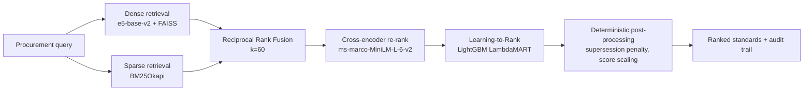

# AI-Powered Indian Standards (IS) Recommendation Engine

A semantic search and recommendation system that helps procurement officials
find the right Indian Standards (IS) for a product, specification or tender
document, by meaning rather than by keyword matching.

Built for the Smart India Hackathon problem statement from the **Ministry of
Consumer Affairs, Department of Consumer Affairs**.

---

## ⚠️ Data coverage and limitations: read this first

We would rather state our scope plainly than imply coverage we do not have.

| | Status |
|---|---|
| **Standards in the corpus** | **33,023 records** ([`data/standards_corpus_full.json`](data/standards_corpus_full.json)), covering **26,818 distinct standards**. Each published edition is its own record, and every one is either listed by BIS (its Know Your Standard record or its new standards portal) or published in the archive: the 23 editions from the original pilot data that were neither (IS 8112:2018, IS 12894:2020 and others) were removed, each recorded in [`data/pilot_corrections.json`](data/pilot_corrections.json) with the real standard it stood for |
| **Coverage of BIS's catalogue** | **23,702 of the 23,831 editions BIS lists as current are held (99.5%)**, including the **1,681 standards BIS published or revised between 1 October 2025 and 4 October 2026** (763 new, 918 revisions), read from its new standards portal. 11,198 records were added from BIS's record because the archive never had the standard or had only an older edition |
| **Current vs. superseded** | **23,831 current** and **9,192 superseded** editions. An edition is superseded when BIS lists it as withdrawn (**7,233**, of which 90 were withdrawn after October 2025 and carry the date) or when the corpus holds a newer edition of the same standard (a 2026 revision supersedes its 1961 edition, IS 1946). A withdrawn edition names its replacement: the one BIS names, or, where BIS names none, the newer edition BIS lists as current or the replacement BIS names for a later edition |
| **Where it comes from** | The complete Public.Resource.Org archive of the BIS catalogue on archive.org (21,937 readable standards out of 22,024 items, including 579 IS/ISO and IS/IEC adoptions and 69 SP publications such as the National Building Code), plus BIS's Know Your Standard records and its standards portal (standards.bis.gov.in) for what the archive lacks |
| **Where the text comes from** | **16,656** records carry the **published SCOPE clause** of the standard from its archived copy (OCR of a scanned document, so it contains recognition errors), up to its first sub-clause. **1,413** standards BIS published since October 2025 carry their own scope clause, read from the document BIS's portal links (born-digital text; only the clause is kept). **2,359** newer editions held only on BIS's record are searched with the scope clause of the edition they revise, and their page says so. **491** standards also carry **BIS's own plain-language summary** (published on its portal for 7 in 10 standards under compulsory certification): its opening is searched, and the page shows it whole, labelled as BIS's. **12,580** (38%) are held on their number and official title only, mostly standards the archive holds no text for, and their page says so. **15** pilot records keep a written summary, labelled `scope_written` |
| **Titles** | 3,866 archive titles were broken (the archive's item id in place of a title, the year glued to the front, lower-case starts) and are replaced with BIS's official title; BIS's own text was double-encoded in 1,556 titles ("–" for a dash) and is repaired, and the amendment notes BIS writes into 168 titles ("... Specification Amendment - 2") are removed. The original is kept as `archive_title` |
| **Currency** | Current to BIS's standards portal as of 5 October 2026: the engine's first in-app refresh completed then, with 22,256 editions checked against BIS's current record. While the engine runs it keeps itself current: at startup, if the last complete refresh is more than a week old, it reads what BIS has published, withdrawn or amended since, rebuilds the index in the background and swaps the new corpus in without a restart |
| **Checked against BIS's records** | **30,917 of 33,023 editions** match BIS's own record (Know Your Standard, all 34,300 pages read 28 September 2026, brought up to date from the portal): whether the edition is withdrawn, what replaced it, and its amendments. The other 2,106 have no BIS record under that number and keep the archive's status. The scope text itself is still the archive's OCR, so every record keeps `"verified": false` |
| **Certification data** | **BIS's full lists of products under compulsory certification**: 749 standards across Scheme I (ISI mark), Scheme II (CRS) and Scheme X, each with its Quality Control Order, gazette notification and a link to the order (read 27 September 2026); and **BIS hallmarking**: gold jewellery and artefacts (IS 1417) compulsory under the Hallmarking Order in 392 districts, with its exemptions, and silver (IS 2112) voluntary, read from the gazette notifications (saved in `data/certification/source/hallmarking/`). Orders whose enforcement is deferred (most of the Electrical Equipment QCO, by S.O. 5038(E)) are shown as **not yet mandatory**. A standard not on the lists reports `not_listed`, stated with the date the lists were read |
| **Amendments** | **BIS's official record for 35,601 editions** (5,574 with amendments, 9,052 in all, 115 of them issued after October 2025), with the year of **6,727** of those amendments: from BIS's portal (which lists each amendment with its year) and from the amendment slips bound into each standard's archived copy (3,428 standards, 5,424 slips, with excerpts). Where the copy shows more amendments than BIS lists, the larger number is shown and marked disputed. A standard BIS has no record for falls back to its copy, which reports "at least" and the year the copy is current to |
| **Allied standards** | **88,632 links from 16,944 standards**, read automatically from each standard's own REFERENCES clause and citations, plus 25 read and typed by hand, grouped as normative references, material specifications, test methods, **safety standards**, terminology and installation practice. Every automatic link carries the passage it was read from; on samples about 97% were read correctly. **Related product standards** are the standards closest in scope, read from the search index and required to share a word of the title |

**What this means in practice:** search covers 99.5% of the editions BIS
lists as current, including those published up to 4 October 2026;
certification comes from BIS's own compulsory lists and hallmarking order; and
edition status and amendments come from BIS's record for each standard. What
remains open: 38% of records are searchable on their title alone (mostly
standards the archive holds no text for), a quarter of
amendments have no date, scope text is OCR that has not been proof-read, and
the corpus stays current only if the weekly refresh is scheduled.

## Usage figures

The dashboard at `/app` reports counted usage, not a mock-up. Every figure is
read from two append-only logs the engine writes itself:

| File | Written when | Feeds |
|---|---|---|
| `data/query_logs.jsonl` | every search `/retrieve` serves | volume, match rate, response time, sector spread |
| `data/interaction_logs.jsonl` | a standard is added to a spec or dismissed | acceptance rate, and the LTR retraining loop |

Three rules keep the screen honest, and each is covered by a test:

- **Synthetic records are never counted as usage.** 124 interaction records
  were generated to bootstrap the ranker. They are real records of a real
  pipeline run, but nobody used the system to produce them, so they are
  excluded from every live figure and reported separately.
- **A figure that cannot be computed is not shown.** An acceptance rate with
  no decisions behind it renders as a dash, never as 0%. Those are different
  statements.
- **An unreachable engine is not an empty one.** A backend that is down shows
  an error, not "no queries yet".

A fresh clone starts with no query log and the dashboard says so, which is the
correct answer for an engine nobody has searched.

### Auditing a tender, and reading a BOQ

Two screens take a document rather than a query:

- **Audit** (`/app/audit`) reads a tender, finds every IS number it cites, and
  checks each against the corpus: superseded editions (naming the
  replacement), amendments in force that the citation omits, citations with no
  edition year, and standards the corpus cannot verify at all.
- **Upload tender / BOQ** (`/app/boq`) splits a bill of quantities into its
  line items and runs a **separate search for each**. This matters more than
  it sounds: flattening a BOQ into one query lets the first item's vocabulary
  dominate the ranking, so the cement silently loses to the cable.

The audit's limit is the important part. It checks the citations a document
**already makes**, not whether the tender cites the right standards for the
goods it describes, which needs someone to read the specification. So a
document with no findings has not passed, and a document citing nothing at all
produces no findings while being the worst case. Both states say so.

### Standards hygiene and corpus health

Two more screens read from the engine rather than from fixtures:

- **Standards hygiene** (`/app/alerts`) lists superseded editions and
  standards with published amendments in force, computed from the corpus.
  Each superseded edition names the current edition that replaces it. With
  the full archive loaded that is about 2,240 findings.
- **Corpus health** (`/app/compliance`) counts how complete the corpus's own
  metadata is (certification confirmed vs. unverified, amendments
  researched), always as a ratio against the total, because 13 confirmed
  records mean nothing without the total they are out of.

Neither is a notification feed. The corpus follows BIS through a weekly
refresh from its standards portal, run by the engine itself while it is in
use, not a live feed, so findings carry no relative time: a withdrawal shows the
date BIS gives for it where the portal has one, and nothing more. A short
amendment list is not an all-clear either: a standard BIS has no record for is
checked only against its archived copy, and the screen states the unchecked
remainder rather than implying a clean bill of health.

## Plain-language explanations (optional)

With a local [Ollama](https://ollama.com) server running and
`qwen2.5:7b-instruct` pulled, each recommended standard carries a short
**Why it matches** note: what the standard covers and how it relates to the
requirement (the product itself, a different grade, a different product).

```powershell
winget install --id Ollama.Ollama -e     # Windows; see ollama.com for macOS/Linux
ollama pull qwen2.5:7b-instruct          # about 4.7 GB
```

**Results never wait for it.** A search returns at retrieval speed and the
notes fill in afterwards from a separate `POST /explain` call, with a
placeholder on each card while they are written. Measured on an RTX 4060
laptop GPU: results in about 0.4 s, notes about 4 s later. The engine loads
the model in the background at startup and asks Ollama to keep it resident
for 30 minutes, because the first load takes over a minute.

The **Explain matches** chip in the search box appears only when `/health`
reports the model ready (`explanations_available`), and is on by default
once it does; the choice is remembered per browser. The engine rechecks
availability on a timer, so starting Ollama after the engine works without a
restart. Without Ollama the option is simply not offered.

**The model never decides anything.** It only describes candidates retrieval
already chose; it does not rank, filter, or contribute to certification or
supersession verdicts. Every IS number it returns is checked against the
candidate list and discarded if it was not one of them, because a fabricated
standard number in a tender document is the worst output this system could
produce. `/explain` only passes the model standards the corpus actually holds,
and reasons too short to say anything ("fits the requirement") are dropped
rather than shown. Out-of-scope queries skip it entirely, so a no-match result
never acquires a fluent explanation of why the wrong standards almost fit.

---

## Languages

Queries can be written in **English and 12 Indian languages**: Hindi,
Marathi, Bengali, Assamese, Tamil, Telugu, Kannada, Malayalam, Gujarati,
Punjabi, Odia and Urdu. The script is detected (Marathi told from Hindi, and
Assamese from Bengali, by their own words and letters), and a script none of
them uses is told so rather than given a silent "no match". Non-English
queries are translated to English before searching (NLLB-200, running
locally, no API key; `TRANSLATION_MODEL` picks the checkpoint), and the UI
shows both what you typed and what was actually searched, because a wrong
machine translation quietly returning wrong standards is the failure worth
guarding against. Before translating, procurement words whose literal
translation goes wrong are replaced by their English trade name, from a word
list per language ([`data/translation_glossary.json`](data/translation_glossary.json),
`TRANSLATION_GLOSSARY=0` turns it off); the language is detected on what was
typed.

This is not cosmetic. Untranslated, a Hindi query scores −8.4 on the
cross-encoder and is correctly rejected as no-match; translated, the same
query scores +3.9 and returns the standard the English phrasing returns.

The interface itself is English-only; only queries and results are
multilingual.

---

## Accuracy, and saying when it does not know

`/retrieve` returns a `confidence` of `strong`, `uncertain` or `none`, judged
on the cross-encoder relevance score of the top hit, which, unlike the
per-response `final_score`, is comparable across queries. On a `none` verdict
the UI drops the "Recommended standards" heading entirely and presents the
results as "Nearest text matches … not recommendations".

**Current measurement: 33,023 records (5 October 2026)**

| Query set | Right standard first | In the top five |
|---|---|---|
| 52 buyer-language product queries in English ([`data/benchmark_queries.json`](data/benchmark_queries.json), `eval/benchmark.py`) | 36/52 (69%) | **49/52 (94%)** |
| The same kind of items in 12 Indian languages, 8 each (96 queries) | 57/96 (59%) | **90/96 (94%)** |
| A second multilingual set, 8 other items in 12 languages ([`data/benchmark_heldout_queries.json`](data/benchmark_heldout_queries.json)), see below | 78/96 (81%) | **92/96 (96%)** |
| 236 held-out queries (`tests/test_full_corpus_accuracy.py`, `FULL_EVAL_QUERIES=0`), same standard in any edition | 0.852 | **0.962** |

In other languages the gain is the translation word list
([`data/translation_glossary.json`](data/translation_glossary.json)):
procurement words whose literal translation went wrong ("छत का पंखा" came back
as "roofed fan") are replaced by their English trade name before translating.
Measured with it off and on, it took the first set from 41 to 57 first and 77
to 90 in the top five, and left the second set unchanged, whose items are
mostly words the translator already handles (it was written before the list,
to check the list does no harm on items it was not made from). The second
set's later gains are not all independent: two everyday-word mappings
(electric meter, domestic LPG cylinder) were added after reading its misses
and account for 22 of its 30 extra first places; BIS's summary of IS 2347
accounts for another 8 (pressure cookers).

The benchmark is committed so every figure can be re-run after a change; the
spot checks quoted before it (30 and 28 fresh products, 11 multilingual
queries, 27 tender lines) were typed at the time and not all saved. On the
benchmark at the start of 4 October the figures were 29/52 and 47/52 in
English, 40/96 and 67/96 in other languages, and 0.826 / 0.945 held out. What
moved them: the scope clause read where its heading runs into the text (IS
10500, drinking water, had been searched by a sentence from its foreword), new
editions searched with the scope of the edition they revise, and BIS's
amendment notes taken out of 168 titles. Right-first in other languages is
held back mostly by translation: "ceiling fan" comes back as "roof fan" or
"sealing fan" from Hindi, Urdu and Gujarati. The larger NLLB model (1.3B) was
tried and rejected: eleven times slower on a CPU and no more often right.

Query time, warm, on a laptop CPU: median 367 ms, 90th percentile 624 ms, over
69 product queries.

The held-out queries are written from the standards' titles, so they are the
easiest set and the least like a buyer. On 28 September, scored on the exact
edition labelled, they gave 0.826 / 0.928; at 21,848 records, before 9,524 of
BIS's current standards were added, 0.9153 / 0.9873. The added records put more
near-identical parts and editions beside each label; on the fresh product
queries the same change made no difference. Which edition to cite is decided
by the supersession rule (the edition in force ranks first and a superseded
one names it), which is tested on its own, so the held-out test scores the
standard in any edition. The tender-line sample is small and informed two of
the fixes (short forms written with full stops, rate boilerplate); one of its
six misses is the schedule's own wrong citation. The learned ranker is not
trained for this corpus yet (`/health` reports `ltr_model_loaded: false`), so
these figures come from hybrid retrieval plus the cross-encoder.

**Confidence thresholds, calibrated at full size**
(`standards-retrieval/eval/calibrate_confidence.py`). On 21,848 standards the
top cross-encoder score of 589 in-scope queries never fell below +1.25, 35
requests no standard covers (services, software, travel, insurance,
nonsense) never rose above −2.68, and realistic short phrasings of covered
products ("cotton bedsheet", "bricks for wall construction") sat between −1.8
and 0. So `none` is now below −2.25 (it was −6.0, set on 30 standards, which
let 29% of out-of-scope requests through as `uncertain`), and vague but
covered wording stays `uncertain` instead of being told it is out of scope.
A miss is described as "no close match", not "outside the covered sectors":
"laptop computer" finds nothing relevant because no title says "laptop", yet
BIS covers laptops (IS 13252, in the corpus).

**The learned ranker was retrained for this corpus and rejected.** On the 236
held-out queries it scored NDCG@5 0.919 against 0.961 for the cross-encoder it
would replace (top-1 84.7% vs 92.4%), so the promotion gate kept it out and
the engine serves the cross-encoder ranking. Its training data is 353
synthetic queries; it needs real accept/dismiss feedback from use to earn its
place.

The older figures in
[`standards-retrieval/MODEL_AND_EVALUATION.md`](standards-retrieval/MODEL_AND_EVALUATION.md)
(Top-1 95.8%, NDCG@5 0.9846) were measured on a **30-standard** corpus against
24 queries written alongside it. They show that each stage of the pipeline
improves on the one before; they are not a claim about accuracy over the full
catalogue.

---

## Architecture


```mermaid
flowchart LR
    Q[Procurement query] --> Dense[Dense retrieval<br/>e5-base-v2 + FAISS]
    Q --> BM25[Sparse retrieval<br/>BM25Okapi]
    Dense --> RRF[Reciprocal Rank Fusion<br/>k=60]
    BM25 --> RRF
    RRF --> CE[Cross-encoder re-rank<br/>ms-marco-MiniLM-L-6-v2]
    CE --> LTR[Learning-to-Rank<br/>LightGBM LambdaMART]
    LTR --> POST[Deterministic post-processing<br/>supersession penalty, score scaling]
    POST --> OUT[Ranked standards + audit trail]
```

A four-stage retrieval funnel: cheap recall-oriented retrieval first, then
progressively more expensive and more precise re-ranking over a narrowed
candidate pool, then deterministic business rules that no model is allowed to
override.

---

## Repository layout

| Path | Purpose |
|---|---|
| [`standards-retrieval/`](standards-retrieval/) | **The backend.** Retrieval, ranking, LTR training, evaluation, feedback loop. Single source of truth |
| [`data/`](data/) | Datasets, the archive ingest and the corpus build; see [`data/README.md`](data/README.md) |
| [`frontend/`](frontend/) | React + Vite UI. Every screen runs against the backend; there is no sample data left in it |
| [`services/knowledge-reasoning/`](services/knowledge-reasoning/) | Graph expansion and compliance validation (fixture-backed; see its `INTEGRATION.md`) |
| [`app/`](app/) | Postgres/Neo4j/Chroma ingestion layer, the upgrade path from flat files. Reuses `standards-retrieval/` rather than vendoring it |
| [`api/`](api/) | Earlier standalone API prototype |

A duplicate of the retrieval pipeline previously lived under
`app/services/standards_retrieval/`. It was removed in Phase B; the code
remains in the git history (commit `af9ea72`).

All work happens on the `main` branch.

---

## Setup

### Requirements

- **Python 3.11**. The ML stack (torch, faiss, lightgbm) has no wheels for
  Python 3.14, which is the default `python` on some machines.
- **Node.js 20+**
- **Tesseract OCR** (optional), for reading scanned tender PDFs.

On Windows, all of these install with winget:

```powershell
winget install --id Python.Python.3.11 -e --scope user
winget install --id OpenJS.NodeJS.LTS -e
winget install --id Git.Git -e
winget install --id UB-Mannheim.TesseractOCR -e
```

### Backend

```powershell
py -3.11 -m venv .venv
.venv\Scripts\python -m pip install --upgrade pip

# CPU-only torch (~200 MB instead of the ~2.5 GB CUDA build)
.venv\Scripts\python -m pip install torch --index-url https://download.pytorch.org/whl/cpu
.venv\Scripts\python -m pip install -r standards-retrieval\requirements.txt
```

Run the API on the full corpus (this is what the site serves):

```powershell
# PowerShell, from the repository root
$env:STANDARDS_CORPUS = 'full'
.venv\Scripts\python -m uvicorn main:app --port 8000 --app-dir standards-retrieval
```

```bash
# bash
STANDARDS_CORPUS=full .venv/Scripts/python -m uvicorn main:app --port 8000 --app-dir standards-retrieval
```

The first start downloads the embedding and cross-encoder models from Hugging
Face (a few hundred MB). Later starts use the local cache and take about 20
seconds, most of it loading the models.

- API docs: http://localhost:8000/docs
- Health: http://localhost:8000/health

Every other route needs a signed-in session or an API key (see
[Accounts](#accounts-and-sign-in) below).

| Variable | Default | Purpose |
|---|---|---|
| `STANDARDS_CORPUS` | `mock` | which corpus to serve (below) |
| `ACCOUNTS_DB` | `standards-retrieval/storage/accounts.db` | the accounts database |
| `AUTH_REQUIRED` | `1` | `0` opens the engine routes without sign-in; only the unit tests do this |
| `ALLOWED_ORIGINS` | none | extra browser origins for a deployment, comma separated |
| `REGISTRATION` | `open` | `closed` hides "Create an account"; members are then added by an administrator only |
| `EXPLANATION_WARMUP` | `1` | `0` skips loading the local language model at startup |

#### Choosing a corpus

`STANDARDS_CORPUS` picks the corpus; `/health` reports which one is loaded.
Indexes and models are stored per corpus, so switching never overwrites
another corpus's artifacts.

| Value | Corpus | Used for |
|---|---|---|
| `full` | 33,023 records: the archive and BIS's record | the site |
| `canonical` | the 45 curated pilot standards | the end-to-end suite and the demo script |
| `mock` (default) | the original 30 standards | the unit tests and the committed ranker |

#### Rebuilding the full corpus

One script fetches the whole archive collection, merges it, rebuilds the
indexes and logs to `data/archive/full_ingest.log`. Fetched texts are cached,
so a re-run only downloads what is new:

```powershell
powershell -File data\run_full_ingest.ps1              # fetch, merge, index
powershell -File data\run_full_ingest.ps1 -From index   # resume a failed run
```

Restart the API afterwards to serve the new corpus. See
[`data/README.md`](data/README.md) for what each stage does.

### Frontend

```powershell
cd frontend
npm install
npm run dev
```

Open http://localhost:5173. The site calls the live backend, so **start the
backend first**. The UI says so plainly if it cannot reach it, and never
substitutes canned results for live ones.

To point at a backend on a different host or port, copy `.env.example` to
`.env` and set `VITE_API_URL`.

The interface uses Material You (Material Design 3), light scheme only. The
search screen works like a modern AI prompt: a centred composer with
suggestions before the first search, then a conversation thread with the
composer docked at the foot. The sidebar folds to an icon rail, and the
account menu at the top right holds the email, organisation, settings, the
guided demo and sign out. The homepage reads the corpus size live from the engine.

### Accounts and sign-in

There is no default account and no shared demo password. The first time the
site is opened on a new installation, the sign-in page asks for the
organisation's name and creates its **administrator** account. After that:

- **Create an account** (a link on the sign-in page) registers a *new*
  organisation with the registrant as its administrator. It never joins an
  existing organisation: that would hand a stranger its members, keys and
  activity, so joining is by an administrator's invitation only.
  `REGISTRATION=closed` turns self-registration off.

- The administrator adds colleagues in **Settings, Organisation**, choosing a
  role for each. Each new member gets a temporary password, shown once, which
  they must replace the first time they sign in. There is no mail server, so
  the administrator passes it on.
- **Roles.** A *procurement officer* searches, audits and assembles
  specifications. An *administrator* also manages members and the
  organisation, sees the organisation-wide activity trail, the corpus health
  and engine status screens, and all API keys. An *integrator* can create API
  keys for connecting portals. A *private organisation user* has search, audit
  and certification lookup.
- **Security.** Passwords are hashed with scrypt; session tokens and API keys
  are stored only as SHA-256 hashes, so a copy of the database holds no working
  credential. Five wrong passwords lock that email for 15 minutes. Changing a
  password signs out every other session, and disabling a member signs them
  out at once.
- **Forgotten passwords.** With a mail server configured (`SMTP_HOST`,
  `SMTP_FROM` and `PUBLIC_URL`, see `standards-retrieval/mailer.py`), "Forgot
  password?" on the sign-in page emails a single-use link valid for an hour;
  the reply is the same whether or not the address has an account, requests
  are rate limited, and a reset signs out every session. Without one, an
  administrator resets it from Settings.
- **API keys** (administrators and integrators, Settings, API keys) are shown
  once when created. Send one as `Authorization: Bearer sk_...` or
  `X-API-Key: sk_...`. Each key counts its calls and can be revoked. A key
  reaches the engine's search and standards routes only, never accounts,
  members or keys, whoever created it; it can be issued for named web
  addresses (for the portal widget, whose key anyone can read in the page);
  and it is limited to `API_KEY_RATE_PER_MINUTE` calls (120 by default).
- **Activity trail.** Every search, scenario, upload, decision on a result,
  project change, sign-in and settings change is recorded against the account
  that did it (Settings, Activity, exportable as CSV).
- **Projects.** The spec basket is the user's active project, saved on the
  server. My projects lists them all; open, rename, empty or delete any of them.

Accounts live in one SQLite file (`ACCOUNTS_DB`), which is git-ignored. Back
it up with the rest of the deployment.

#### What each screen reads

| Screen | State |
|---|---|
| `/login` | **Live.** `/auth/status`, `/auth/setup`, `/auth/login` |
| `/app/query`: search and results | **Live.** `POST /retrieve` |
| `/app/catalogue`: standards catalogue | **Live.** `GET /standards/search`, one page at a time |
| `/app/standard/:code`: standard detail | **Live.** `GET /standards/{id}` |
| `/app`: usage dashboard | **Live.** `GET /stats` |
| `/app/alerts`: standards hygiene | **Live.** `GET /alerts` |
| `/app/compliance`: corpus health | **Live.** `GET /corpus-health` |
| `/app/admin`: engine status | **Live.** `/health`, `/stats`, `/corpus-health` |
| `/app/audit`: tender citation audit | **Live.** `POST /audit` |
| `/app/boq`: tender / BOQ upload | **Live.** `POST /boq` |
| `/app/map`: related standards map | **Live.** `GET /standards/{id}/related` |
| `/app/tender`: tender builder | **Live.** `POST /retrieve` |
| `/app/builder`: spec builder | **Live.** The active project + `GET /standards/{id}` |
| `/app/projects`: my projects | **Live.** `/projects`, and your searches from `/activity` |
| `/app/certification`: certification and compliance | **Live.** `GET /certification-rules` |
| `/app/simulator`: scenario simulator | **Live.** `POST /simulate`, two full searches and their difference |
| `/app/settings`: profile, password, organisation, API keys, activity | **Live.** `/auth/*`, `/org/*`, `/keys`, `/activity` |
| Homepage | Live corpus size from `/health`; the hero panel is an illustration |

The scenario simulator takes a description and the conditions of a use case
(outdoors, marine, buried, fire performance, a rating) and runs the full
search with and without them. It shows which standards come into play, which
drop out and which change rank. Every standard it shows came from a real
search over the catalogue.

---

## Windows note: line endings and model files

This repository contains a LightGBM model (`models/ltr_model.txt`) whose
header encodes **byte offsets** into the file. With Git's `core.autocrlf=true`
(the Windows default), checkout rewrites LF to CRLF, every offset shifts, and
the model fails to load with `Model format error, expect a tree here`.

[`.gitattributes`](.gitattributes) marks these artifacts as binary to prevent
this. If you cloned before it existed and see that error, re-checkout the file:

```bash
git rm --cached standards-retrieval/models/ltr_model.txt
git checkout -- standards-retrieval/models/ltr_model.txt
```

---

## What is built

| Capability | State |
|---|---|
| Semantic search (dense + BM25 + cross-encoder + learned ranker) | Live over 33,023 records, 99.5% of the editions BIS lists as current as of 4 October 2026, ~370 ms |
| Refuses to answer outside its coverage | Live, thresholds calibrated on the full corpus |
| Superseded editions flagged, with the current edition named | Live, 8,011 editions (7,141 withdrawn per BIS) |
| Mandatory certification with its governing order: BIS Product Certification (ISI), CRS, Scheme X and Hallmarking | BIS's full compulsory lists, 749 standards, plus the Hallmarking Order for gold (silver voluntary) |
| Published amendments with paste-ready citation | BIS's count for 33,761 standards (5,548 amended), dates from 3,428 archived copies |
| Tender abbreviations and everyday words (GI pipe, M25 concrete, MCB, UPS, laptop, office chair) | Live, 43 abbreviations and 27 everyday terms |
| Allied standards: normative references, test methods, terminology, safety, installation and related products | 88,632 links read from the standards, plus related products by scope |
| Queries in 13 languages (English and 12 Indian), translated locally | Live; an unsupported script is told so |
| Tender document upload (PDF, Word, Excel, text; OCR for scans) | Live |
| Integration with procurement portals: API keys, OpenAPI, and an embeddable widget | Live, see [docs/integration-guide.md](docs/integration-guide.md) |
| Tender builder with live recommendations and clause generation | Live |
| Usage dashboard counted from the engine's own logs | Live |
| Standards-hygiene findings (superseded editions, amendments in force) | Live |
| Corpus health: certification and amendment coverage | Live |
| Tender citation audit (superseded, amendments, undated, uncovered) | Live |
| Bill-of-quantities split with a search per line item | Live |
| Related-standards map: what a standard cites and what cites it | Live |
| Engine status console | Live |
| Certification rules with their governing QCO, gazette notification and a link to the order | Live, deferred orders flagged, any standard can be checked |
| Plain-language explanations from a local LLM | Optional, off by default |
| Scenario simulator: what changes when the requirement changes | Live |
| Audit of what cited standards depend on but the tender omits | Live, read from each standard's references and obligations |
| Everyday product words ("laptop", "geyser") mapped to the standards' terms, with BIS product listings | Live |
| Accounts, roles, API keys, per-user activity trail | Live; keys limited to the engine's routes, a rate and optionally the portal's web address |
| Password reset by email | Live when a mail server is configured; otherwise by an administrator |
| Weekly refresh from BIS's new standards portal (new standards, revisions, withdrawals, amendments) | Live: runs in the background when the engine starts and the data is a week old; progress in `/health` |
| Projects saved per user on the server | Live |
| Guided demo that drives the live app | Live, from the homepage or the account menu |

Everything runs locally. No cloud services and no third-party API keys.

## Testing

```powershell
# Backend
$env:PYTHONPATH = 'standards-retrieval'
.venv\Scripts\python -m pytest standards-retrieval\tests -q

# Accuracy over all 236 held-out queries on the full corpus (a few minutes)
$env:FULL_EVAL_QUERIES = '0'
.venv\Scripts\python -m pytest standards-retrieval\tests\test_full_corpus_accuracy.py -q -s

# Buyer-language benchmark, English and 12 Indian languages (a few minutes)
cd standards-retrieval; ..\.venv\Scripts\python evalenchmark.py --out results.json; cd ..

# End-to-end: the test engine (throwaway usage logs and accounts), the dev
# server, then the suite, each in its own terminal
cd frontend; npm run e2e:engine
cd frontend; npm run dev
cd frontend; npm run test:e2e
```

Last run (2026-10-05): the backend suite is **362 passed, 1 skipped**, with
all 236 held-out queries in the full-corpus accuracy tests. End to end on
mobile, against the test engine beside a running one, 73 of 75 passed: the
title-only example (IS 19609:2026) had gained its own scope clause and was
replaced, and the guided demo's full sequence timed out once and passed when
run again alone, so it is intermittent in a full run. The real usage logs were
byte-for-byte unchanged after the run. Desktop last ran in full on 4 October. The suite signs in once through `e2e/global-setup.js`, creating its own
administrator on an empty installation, and its searches and clicks would
otherwise be recorded as use. So it runs against the test engine,
`npm run e2e:engine`, which keeps accounts and both usage logs
(`USAGE_LOG_DIR`) in a throwaway folder and does not refresh from BIS; the
setup refuses an engine that writes to the real logs unless
`E2E_ALLOW_REAL_LOGS=1`. To run beside an engine already on :8000, set
`E2E_ENGINE_PORT`, start the dev server with `VITE_API_URL` pointing at it on
another port (listed in `E2E_ALLOWED_ORIGIN`), and point the suite at both
with `E2E_API_URL` and `E2E_BASE_URL`.

The end-to-end suite runs against a live backend rather than mocks, because
the failures worth catching are integration failures. Two of its tests exist
specifically to stop the honesty guarantees regressing: an out-of-scope query
must render zero recommendation cards, and no screen may carry the
"Illustrative screen" label of the sample data that has been removed. Others check
that the dashboard's query count rises after a search is actually served,
that every standards-hygiene finding names a real IS number (and a critical
one names its replacement), and that the hygiene screen states what it did
not check.

## Demo

[`docs/demo-script.md`](docs/demo-script.md) is a timed seven-minute
walkthrough with the setup checklist, the questions judges tend to ask, and
what to do when something breaks. The app also has a built-in guided demo:
**Start Demo** on the homepage, or **Start guided demo** in the account menu.

## Status

See [`PROGRESS.md`](PROGRESS.md) for the full build log: what was found
broken, what was decided and why, and what remains open.

## License

MIT
